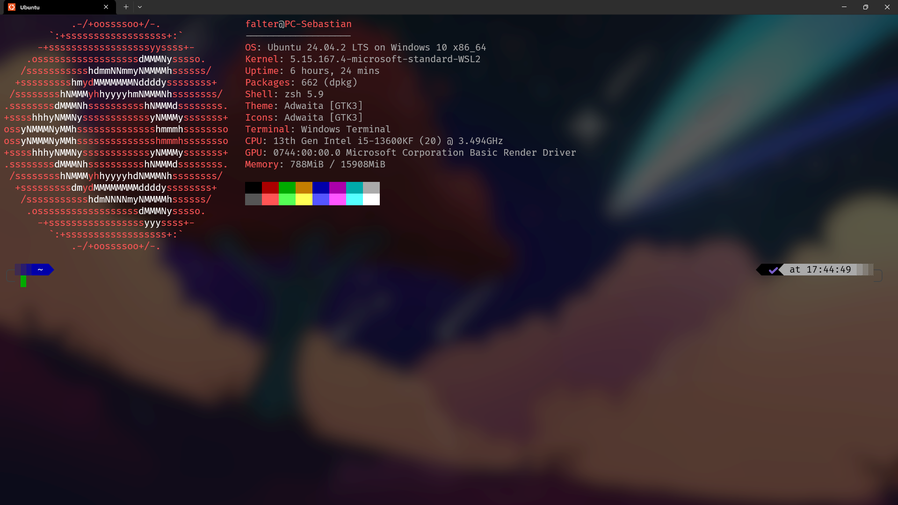

# 💻 My ZSH Dotfiles Setup for WSL (Windows)

This repository contains my personal terminal configuration for **WSL on Windows**, using **Zsh**, **Oh My Zsh**, and **powerlevel10k** – with a clean and minimal look, custom Windows Terminal profile, and a transparent background wallpaper.

---

## 📦 What’s included

- `.zshrc` – Zsh configuration with plugins and clean prompt
- `.p10k.zsh` – powerlevel10k config (Zen mode)
- `.aliases` – Custom aliases for fast command shortcuts
- `install.sh` – One-step installer
- Optional: `fonts/` folder with NerdFont (if not installed)
- Optional: Windows Terminal profile JSON snippet

---

## 🧰 Tools installed by `install.sh`

- `zsh`
- `git`
- `curl`, `wget`
- `lsd` (modern `ls` with icons)
- `neofetch` (system info on startup)
- `bat` (modern `cat`)
- `htop` (interactive process viewer)

---

## 🚀 Installation

```bash
git clone https://github.com/yourname/dotfiles.git
cd dotfiles
chmod +x install.sh
./install.sh
```

Then restart your terminal or run:

```bash
exec zsh
```

---

## 🎨 Windows Terminal Configuration

Here’s the config I use for my Ubuntu WSL profile:

```jsonc
{
  "name": "Ubuntu",
  "source": "Microsoft.WSL",
  "font": {
    "face": "FiraCode Nerd Font Mono",
    "size": 15
  },
  "colorScheme": "IBM 5153",
  "opacity": 75,
  "useAcrylic": true,
  "scrollbarState": "hidden",
  "backgroundImage": "\\wsl.localhost/Ubuntu/home/falter/terminalWallpaper.png",
  "experimental.retroTerminalEffect": false,
  "guid": "{3c411106-319b-56c8-93ba-e36c9825719e}",
  "hidden": false
}
```

📌 **Make sure the image path is valid on your system.**  
You can place your background image inside the repository and adjust the path accordingly.

---

## 🔤 Fonts

To display symbols/icons correctly, use a Nerd Font like:

[FiraCode Nerd Font Mono](https://www.nerdfonts.com/font-downloads)

- Install via right-click → "Install for all users"
- Set it as your Windows Terminal font

---

## 🧼 Features

- ✅ Minimalistic powerlevel10k prompt (Zen mode)
- ✅ Git status shown cleanly in prompt
- ✅ `lsd` for colorized, icon-rich directory listings
- ✅ Handy aliases like `ll`, `gs`, `..`, `c`, `reload`
- ✅ Transparent background with wallpaper
- ✅ NerdFont support for dev icons

---

## 🖼 Screenshot

> _You can insert a screenshot here after uploading it to the repo_

```markdown

```

---

## 🧳 Easy to replicate

With this repo, you can quickly replicate your exact terminal experience across machines (e.g., a new WSL install or laptop).

---

**Enjoy your clean, powerful terminal.**
