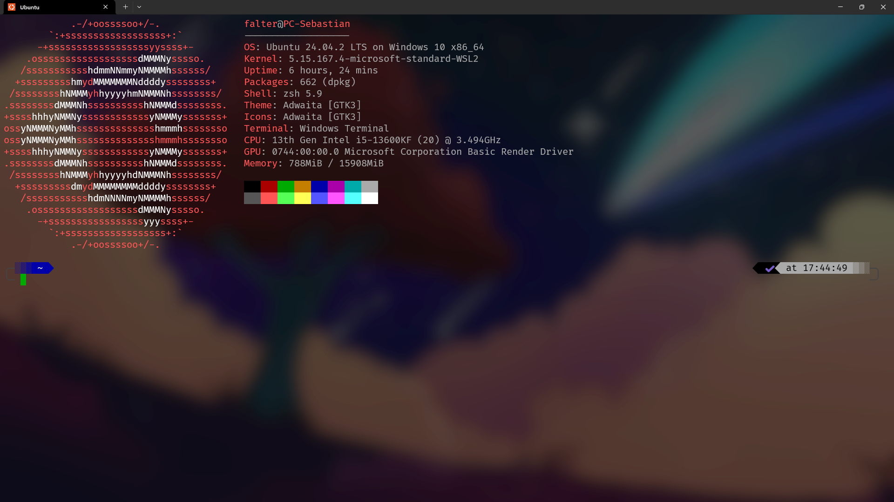

# 💻 My ZSH Dotfiles Setup for WSL (Windows)

This repository contains my personal terminal configuration for **WSL on Windows**, using **Zsh**, **Oh My Zsh**, and **powerlevel10k** – with a clean and minimal look, custom Windows Terminal profile, and a transparent background wallpaper.

## 📦 What's included

- `.zshrc` – Zsh configuration with plugins and clean prompt
- `.p10k.zsh` – powerlevel10k config (Zen mode)
- `.aliases` – Custom aliases for fast command shortcuts
- `install.sh` – Interactive installer with component selection
- `uninstall.sh` – Reverts all changes and restores Bash defaults
- `nvim/init.lua` – Neovim config with lazy.nvim, tokyonight, lualine, nvim-tree
- Optional: Windows Terminal profile JSON snippet

## ⚙️ Getting started with WSL on Windows

Before using this terminal setup, make sure WSL and Ubuntu are installed on your Windows machine.

### ✅ Quick install (Windows 10/11)

Open **PowerShell as Administrator** and run:

```powershell
wsl --install
```

This will automatically:

- Enable WSL
- Install the latest Ubuntu distribution
- Set up WSL 2 as default

After the install is complete, restart your computer.

### 🧠 Manual WSL setup (if needed)

If `wsl --install` doesn't work (older Windows), follow these steps:

1. Enable **Virtual Machine Platform** and **WSL** features:

```powershell
dism.exe /online /enable-feature /featurename:Microsoft-Windows-Subsystem-Linux /all /norestart
dism.exe /online /enable-feature /featurename:VirtualMachinePlatform /all /norestart
```

2. Restart your PC
3. Download and install a Linux distribution (e.g. Ubuntu) from the [Microsoft Store](https://aka.ms/wslstore)
4. Set WSL version 2 as default:

```powershell
wsl --set-default-version 2
```

---

Once you've installed Ubuntu and launched it for the first time, you can continue with the terminal setup below 👇

## 🚀 Installation

```bash
git clone https://github.com/PsydoV2/TerminalSetup
cd TerminalSetup
chmod +x install.sh
./install.sh
```

Then restart your terminal or run:

```bash
exec zsh
```

### 🧩 Interactive Component Selection

The installer lets you choose exactly what to install. If `whiptail` is available (pre-installed on Ubuntu), a **TUI checklist** appears:

```
┌─────────────────────────────────────────────────────────────┐
│ Select components to install:                               │
│ (SPACE to toggle, ENTER to confirm)                         │
│                                                             │
│  [*] Neovim (PPA, 0.9+) + Lua config                       │
│  [*] lsd     – modern 'ls' with icons                       │
│  [*] bat     – modern 'cat' with syntax hl                  │
│  [*] neofetch – system info on startup                      │
│  [*] htop    – interactive process viewer                   │
│  [*] Powerlevel10k theme                                    │
│  [*] zsh-autosuggestions plugin                             │
│  [*] zsh-syntax-highlighting plugin                         │
└─────────────────────────────────────────────────────────────┘
```

All components are **enabled by default** — deselect anything you don't want with `Space`.

Without `whiptail`, the installer falls back to individual `y/n` prompts for each component.

The `.zshrc` is automatically patched to match your selection — skipped plugins are removed from the config, and the theme falls back to `robbyrussell` if Powerlevel10k is not installed.

### 🛡️ Automatic Backups

Before overwriting anything, the installer creates a timestamped backup of your existing dotfiles:

```
~/.dotfiles_backup_20250315_143000/
  ├── .zshrc
  ├── .p10k.zsh
  ├── .aliases
  └── nvim/
```

## 🧰 Available components

| Component | Description | Always installed |
|---|---|---|
| `zsh` + Oh My Zsh | Shell and plugin manager | Yes |
| `git`, `curl`, `wget` | Base tools | Yes |
| Powerlevel10k | Feature-rich, fast prompt theme | Optional |
| zsh-autosuggestions | Fish-style command suggestions | Optional |
| zsh-syntax-highlighting | Live syntax coloring in shell | Optional |
| `neovim` (PPA) | Editor with Lua config + lazy.nvim | Optional |
| `lsd` | Modern `ls` with icons and colors | Optional |
| `bat` | Modern `cat` with syntax highlighting | Optional |
| `neofetch` | System info displayed on startup | Optional |
| `htop` | Interactive process viewer | Optional |

> **Note:** Neovim is installed via the official PPA (`ppa:neovim-ppa/stable`) to ensure version 0.9+, which is required by lazy.nvim. The `apt` version on Ubuntu is often too old.

## 🧼 Uninstalling / Reset to Default

If you want to revert all changes and go back to a standard Bash terminal:

```bash
chmod +x uninstall.sh
./uninstall.sh
```

**What this does:**

- Switches your default shell back to **Bash**
- Removes **Oh My Zsh**, plugins, and the **Powerlevel10k** theme
- Deletes `.zshrc`, `.p10k.zsh`, `.aliases`, and `.vimrc`
- Backs up `~/.config/nvim` before removing it
- Uninstalls `zsh`, `lsd`, `bat`, `neofetch`, `htop`, `neovim` via `apt purge`

> `git`, `curl`, and `wget` are intentionally kept as they are general system tools.

Log out and back in (or restart WSL) after uninstalling for the shell change to take effect.

## 🎨 Windows Terminal Configuration

Here's the config I use for my Ubuntu WSL profile:

```json
{
  "name": "Ubuntu",
  "source": "Microsoft.WSL",
  "font": {
    "face": "FiraCode Nerd Font Mono",
    "size": 15
  },
  "colorScheme": "IBM 5153",
  "opacity": 75,
  "useAcrylic": true,
  "scrollbarState": "hidden",
  "backgroundImage": "\\wsl.localhost/Ubuntu/home/falter/terminalWallpaper.png",
  "experimental.retroTerminalEffect": false,
  "guid": "{3c411106-319b-56c8-93ba-e36c9825719e}",
  "hidden": false
}
```

📌 **Make sure the image path is valid on your system.**
You can place your background image inside the repository and adjust the path accordingly.

## 🔤 Fonts

To display symbols/icons correctly, use a Nerd Font like:

[FiraCode Nerd Font Mono](https://www.nerdfonts.com/font-downloads)

- Install via right-click → "Install for all users"
- Set it as your Windows Terminal font

## 🧼 Features

- ✅ Minimalistic Powerlevel10k prompt (Zen mode)
- ✅ Git status shown cleanly in prompt
- ✅ `lsd` for colorized, icon-rich directory listings
- ✅ `bat` as a syntax-highlighted `cat` replacement
- ✅ Interactive installer — choose only what you need
- ✅ Automatic dotfile backup before every install
- ✅ Transparent background with wallpaper
- ✅ NerdFont support for dev icons

## 🖼 Screenshot



[](https://streamlabs.com/psydoooo/tip)
